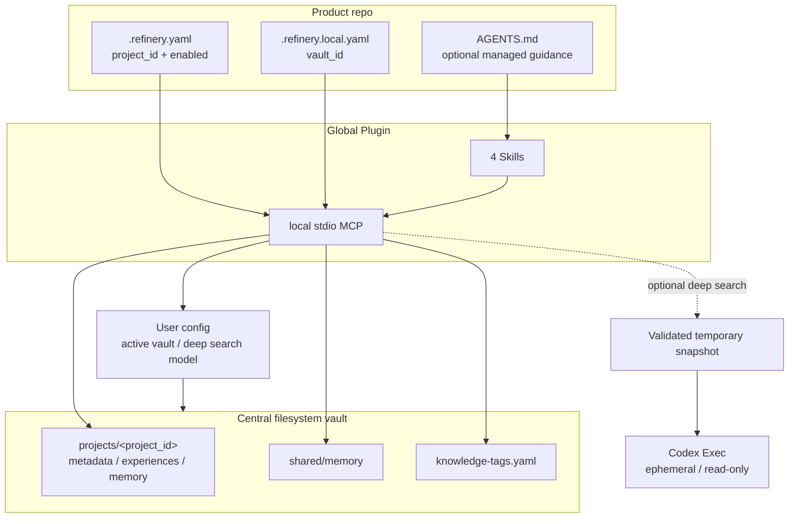

# アーキテクチャ

Knowledge Refineryは、利用repo、グローバルPlugin、ローカルMCP、中央vaultを分離します。
プロダクトのsourceとknowledgeの履歴を混ぜず、repo側には接続情報だけを置きます。

| 要素 | Source of truth | 役割 |
|---|---|---|
| 利用repo | `.refinery.yaml` | project IDと有効状態を共有する |
| ローカルbinding | `.refinery.local.yaml` | repoと個人のvault IDを結び付ける |
| Plugin | SkillsとMCP設定 | Codexの手順とtool interfaceを提供する |
| ユーザー設定 | active vaultのpath、deep search公開状態・model | 接続先と任意toolの公開・modelを選ぶ |
| 中央vault | project/shared knowledge | ナレッジの実体を保存する |

## 境界

- PluginとMCPはユーザー単位でグローバルに1つ導入します。
- active vaultはユーザー設定に1つ持ちます。設定ファイルは `REFINERY_CONFIG` で明示でき、未指定時は `${XDG_CONFIG_HOME:-$HOME/.config}/knowledge-refinery/config.yaml` を使います。`REFINERY_VAULT` でactive vaultを一時overrideできます。
- repo-scoped MCP toolsは`project_path`を受け、server側で`enabled`、project metadata、repoと
  active vaultの`vault_id`一致を検証します。
- symlinkは人間の閲覧用であり、MCPとCLIの必須依存ではありません。
- vault markerのmanagerとschemaを利用前に検証し、未対応schemaへの書き込みを拒否します。
- 中央vaultの書き込みはatomic replaceとpath lockで破損を防ぎ、project metadata、experience、memory、tag taxonomyの更新は`expected_updated_at`による楽観的排他で競合上書きを拒否します。
- 検索は不正文書を隔離し、exact getは対象IDの正規pathを直接検証します。不正文書の一覧は `refinery_validate` が返します。
- 任意のdeep search公開状態もユーザー設定に置きます。MCP起動時にだけ評価し、無効または不正な設定ではtoolを登録しません。
- deep searchはschema検証済みknowledgeだけの一時snapshotを作り、中央vaultやproduct repoをCodex Execへ直接公開しません。snapshotはread-only・ephemeral実行後に破棄します。

## データフロー

1. Skillが `project status` でrepoの有効性を確認する。
2. MCPが `project_path` からproject IDを導出する。
3. domain処理がproject metadataまたはknowledge文書のYAML schemaとprovenanceを検証する。
4. storage層が中央vaultへatomicに保存する。
5. Git履歴を有効にしたvaultでは、vault Gitがknowledge履歴をproduct Gitとは別に追跡する。

deep searchだけは3の後に検証済みsnapshotを作成し、Codex Execへ質問をstdinで渡します。返却JSONの
source IDをmanifestと照合してからMCP responseにします。この経路はstorage層の書き込み処理を
呼びません。
