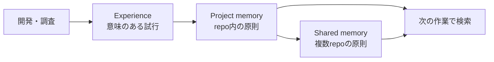

# Knowledge Refinery

Codexで得た開発経験を、次の判断に使えるナレッジへ変えるためのPluginです。
試行を`experience`として残し、繰り返し使える原則を`memory`へ育てます。保存先は
プロダクトrepoから独立したローカル中央vaultです。

-   **初めて使う**

    ---

    Plugin、CLI、中央vault、利用repoを順番にセットアップします。

    [インストールと初期設定 →](getting-started.md)

-   **エージェントに依頼する**

    ---

    明示呼出と自動運用を選び、そのまま使える依頼文を確認します。

    [利用モードと依頼例 →](agent-workflow.md)

-   **仕組みを理解する**

    ---

    Experience、project memory、shared memoryの役割と検索順序を理解します。

    [ナレッジモデルと検索 →](knowledge-model.md)

-   **安全に運用する**

    ---

    Validation、revision競合、Git、バックアップの標準手順を確認します。

    [ナレッジの保守 →](knowledge-operations.md)

## 何を解決するか

| 課題 | Knowledge Refineryでの扱い |
|---|---|
| 失敗や不採用案が会話の外へ消える | 評価可能な試行を`experience`として残す |
| 過去の記録が増えて探せない | タグ、全文、状態、confidenceで検索する |
| 一度の発見を一般則と誤認する | 試行と再利用可能な`memory`を分ける |
| repo固有の知見と汎用知見が混ざる | `project memory`と`shared memory`を分ける |
| プロダクトの履歴へ運用記録が混ざる | 中央vaultを独立したGit lifecycleで管理する |

## ナレッジが育つ流れ

すべてのexperienceをmemoryへ昇格させるわけではありません。根拠、適用条件、限界を確認し、
繰り返し使えるものだけをmemoryにします。詳しい判断規則は
[ナレッジモデルと検索](knowledge-model.md)を参照してください。

!!! important "安全上の境界"
    CLIとMCPはvaultのGit初期化、commit、push、backupを自動実行しません。secret、credential、
    個人情報、顧客データもknowledgeへ保存しません。また、このrepository自身の作業記録には
    Knowledge Refineryを使いません。
