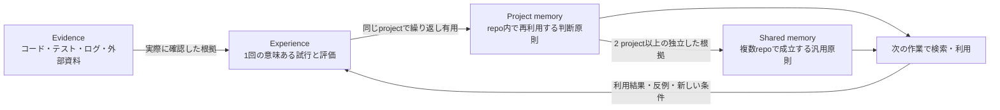
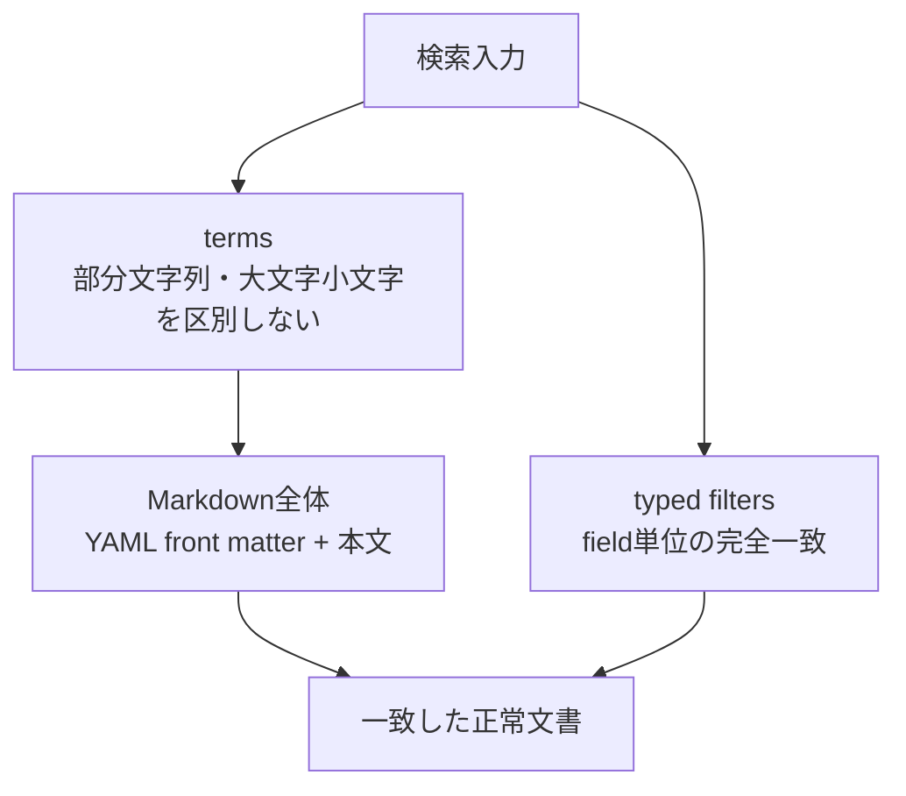

# ナレッジモデルと検索

このページは、ナレッジがexperienceからmemoryへ昇華する流れ、
現行モデルのメタデータ、検索方法をまとめたものです。

## 現行モデルの全体像



すべてのexperienceをmemoryへ昇格させるわけではありません。詳細な試行履歴は
experienceに残し、memoryには再利用する原則、適用条件、限界を記録します。

## 現行のメタデータ

### Experience

| 目的 | field |
|---|---|
| 識別・所属 | `experience_id`, `project_id` |
| 発見 | `title`, `purpose`, `tags` |
| 状態 | `status`, `confidence`, `recorded_at`, `updated_at` |
| 根拠 | `evidence` |
| 関係 | `related_experiences`, `supersedes` |

### Memory

| 目的 | field |
|---|---|
| 識別・適用範囲 | `memory_id`, `scope`, `project_id` |
| 発見 | `title`, `summary`, `tags` |
| 状態・確からしさ | `status`, `superseded_by`, `confidence`, `updated_at` |
| 根拠 | `source_experiences` |

Project memoryはschema上、現在projectのexperienceを最低1件参照します。Shared memoryは
`project-id/experience-id`形式の根拠を使い、異なる2 project以上から支持される必要があります。

運用上、project memoryは反復または相補的な2件以上のexperienceを原則とします。1件だけを
根拠にするのは利用者が明示的に依頼した場合に限り、適用scopeを狭くし、未検証の限界を本文へ
書き、`confidence: high`にはしません。Shared memoryは2 project以上というschema条件を満たしても
自動では作成しません。候補と根拠を提示し、利用者の明示承認を得てから作成または昇格します。

Memoryは通常`active`です。後継原則へ置き換えた場合は`superseded`と同一scopeの
`superseded_by`を使い、後継を持たず撤回する場合は`retracted`を使います。通常検索はactiveだけを
返し、廃止済みmemoryはstatus filterを明示した調査で取得します。

## Statusとconfidenceの決定規則 {#status-confidence}

Experienceのstatusは、試行の成否ではなく「評価可能な結果へ到達したか」で選びます。

| status | 判断規則 |
|---|---|
| `completed` | 計画した試行が評価可能な結果へ到達した。再現可能な失敗や否定結果も含む |
| `inconclusive` | 試行は行ったが、根拠不足、矛盾、測定不能により問いへ答えられない |
| `abandoned` | blocker、cost、risk、前提崩壊により、評価可能な結果の前に停止した |
| `superseded` | 保存済みの後続experienceがこの記録の結論を置き換えた |

confidenceはstatusと独立して、根拠の強さを表します。

| confidence | Experience | Memory |
|---|---|---|
| `high` | 条件を明記した直接根拠が再現可能で、重要な未解決矛盾がない | stated scopeで反復または独立した直接根拠があり、重要な未解決反例がない |
| `medium` | 直接根拠はあるが、反復、coverage、適用範囲が限定的 | 複数の支持はあるが、coverage、独立性、適用範囲が限定的 |
| `low` | 部分的・間接的・再確認不能な根拠、または重要な未解決点がある | 予備的な支持、明示承認された1 source、または重要な競合・不確実性がある |

confidenceの省略は「未評価」を表します。否定結果でも、条件下で再現可能なら
`status: completed`かつ`confidence: high`になり得ます。

## Knowledge tagの階層

ExperienceとMemoryの`tags`は、`/`区切りの最大3階層で管理します。
各segmentはlowercaseの英数字とhyphenを使います。

```text
<facet>/<topic>/<detail>
```

| 階層 | 役割 | 例 |
|---|---|---|
| 1 | 分類軸 | `domain`, `artifact`, `task`, `tech`, `issue` |
| 2 | 主題 | `ml`, `cli`, `debug`, `python`, `performance` |
| 3 | 詳細 | `feature-selection`, `search`, `timeout` |

root facetは上の`domain`、`artifact`、`task`、`tech`、`issue`の5つに固定します。対象領域は
`domain`、成果物は`artifact`、作業種類は`task`、技術は`tech`、症状・品質問題は`issue`を
選びます。新しい概念は適切なroot配下へ追加し、独自rootを作りません。

```yaml
tags:
  - domain/ml/feature-selection
  - artifact/cli/search
  - issue/performance/timeout
```

1階層目はタグの分類軸として揃え、異なる軸は別タグとして付与します。
Project自体の発見に使う`project.yaml.tags`は別のfieldであり、この階層tagと混ぜません。

## Knowledge tagの探索と説明

生成AIはtagを新しく作る前に、`refinery_browse_knowledge_tags`でrootから既存階層を辿ります。
toolは指定した`parent_tag`の直属の子だけを返すため、tag数が増えても必要な枝だけを取得できます。

```text
parent_tagなし → domain → domain/ml → domain/ml/feature-selection
```

各結果にはtaxonomyに保存された説明、子tagの有無、直指定件数、子孫を含む文書件数、
experience・project memory・shared memory別件数が含まれます。文書で使われているtagは説明が
未登録でも階層へ現れ、`description: null`として説明不足を識別できます。

概念名から探す場合は`refinery_search_knowledge_tags`を使います。tag pathと説明を検索対象にし、
複数termはAND条件です。説明は中央vaultの`knowledge-tags.yaml`へ明示的に保存し、利用件数は
knowledge文書から動的に計算します。

## タイトル・サマリー・タグの検索

タイトル、サマリー、タグはいずれも検索できます。ただし、検索方式が異なります。



| 検索対象 | 指定方法 | 一致方法 |
|---|---|---|
| title | `terms` / CLIの位置引数 | Markdown全体に対する部分一致 |
| summary | `terms` / CLIの位置引数 | Markdown全体に対する部分一致 |
| purpose・本文 | `terms` / CLIの位置引数 | Markdown全体に対する部分一致 |
| tags | `tags` / `--tag` | `/`のsegment境界に沿った前方階層一致 |
| experience / memory ID | `experience_ids` / `memory_ids` / `--id` | 完全一致 |
| confidence | `confidences` / `--confidence` | 完全一致 |
| status | experience/memoryの`statuses` / `--status` | 完全一致。memoryは未指定時`active` |
| scope | memoryの`scopes` / `--scope` | 完全一致 |
| source experience | memoryの`source_experiences` / `--source-experience` | 完全一致 |

`--tag domain`は`domain/`配下、`--tag domain/ml`は`domain/ml/`配下も含めて検索します。
`domain/ml`で`domain/mlops`が一致することはありません。

`terms`を複数指定した場合はすべてを含む文書だけが返ります。`tags`も複数指定すると
すべのtag条件を満たす文書だけが返ります。termsとtyped filterを同時に指定した場合もAND条件です。

!!! important
    title専用、summary専用のfield filterはありません。`terms`はfront matterと本文を含む
    Markdownファイル全体を検索します。そのためtitleやsummaryを検索できますが、
    「titleだけに一致」のような限定検索、あいまい検索、形態素解析、関連度順のrankingは行いません。

### CLIの例

```bash
PROJECT_ROOT="$(git rev-parse --show-toplevel)"

# title、summary、purpose、本文を含むMarkdown全体から検索
knowledge-refinery memory search "相関グループ" --project "$PROJECT_ROOT"

# tagは階層検索。domain/mlでその配下も対象になる
knowledge-refinery memory search \
  --project "$PROJECT_ROOT" \
  --tag domain/ml \
  --confidence high

# 複数termはAND条件
knowledge-refinery experience search \
  "rate limit" retry \
  --project "$PROJECT_ROOT" \
  --status completed
```

### MCPの指定例

```yaml
tool: refinery_search_memory
arguments:
  project_path: /absolute/path/to/project
  terms: [相関グループ]
  tags: [domain/ml]
  confidences: [high]
```

検索は次の順序で広げます。

1. 現在project memoryとshared memoryを一緒に検索する。
2. 現在project experienceを検索する。
3. ローカルの結果で判断できない場合、`refinery_list_projects`のmetadataから関連projectを選び、`project_ids`で検索する。
4. 対象projectを合理的に限定できない場合だけ、`all_projects: true`または`--all-projects`でvault全体を検索する。

`project_ids`はselected-project検索、`all_projects: true`はvault全体検索です。両者は併用できず、
併用時はエラーになります。Memory検索にはどのproject scopeでもshared memoryが含まれます。
検索結果はexact getと次の絞り込みに必要な`project_id`、`kind`、`scope`、`status`、`summary`、
`confidence`、`tags`、`recorded_at`、`updated_at`を返し、文書種別に該当しないfieldはnullです。
Memoryをexact getするときは、project scopeだけ`project_id`を渡し、shared scopeでは省略します。

Project metadataの`name`、`summary`、`tags`、`technologies`は、
`refinery_list_projects`で一覧取得して横断検索先を選ぶための情報です。現時点では
experience / memory検索の`terms`や`tags`へ自動的には含まれません。
